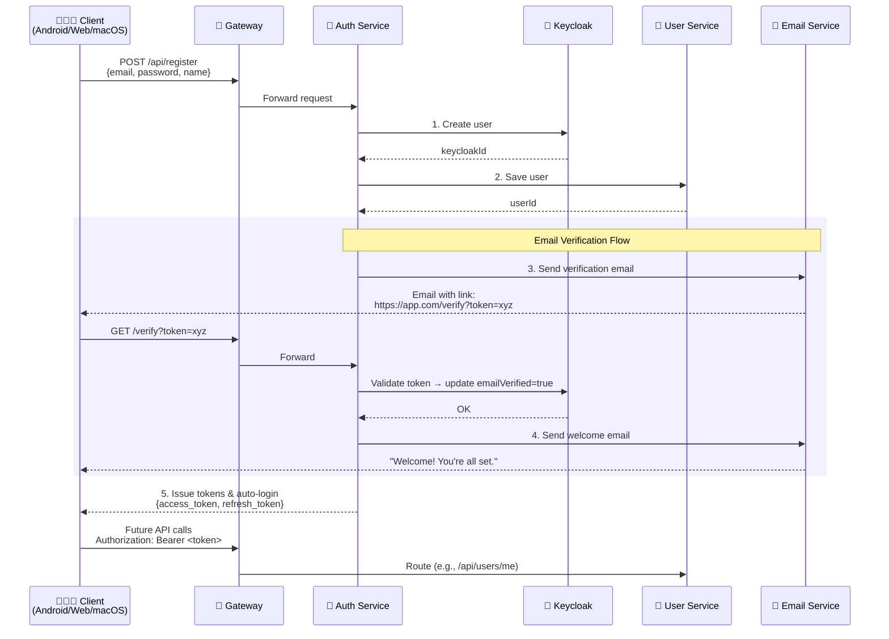
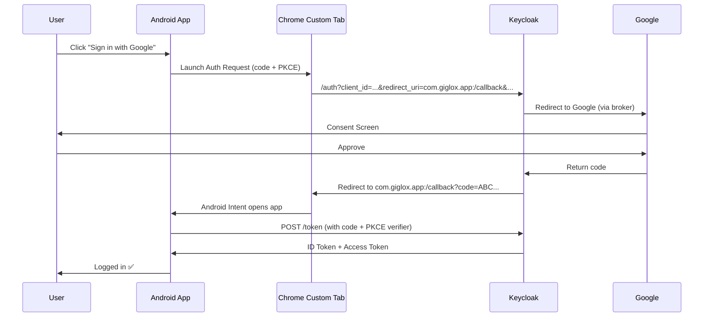

### THIS DIAGRAM REPRESENTS AN AUTHENTICATION FLOW USING KEYCLOAK AND SOCIAL LOGIN PROVIDERS
* we are using auhentication via Keycloak with social login providers (Google, Facebook, Apple)
* after successful login, Keycloak returns ID token and Access token (JWT)
* the client (Android/Web) sends a request to our User Service to create or update the user
* the User Service may optionally validate the token with Keycloak or fetch user info via the userinfo endpoint
* finally, the User Service saves the user data, linking it to the Keycloak subject (sub) and responds with a 201 Created status and an app-specific user ID

    





# App Social Login Help 

--- 
## Google

### 1. Add dependency (```build.gradle:app```)

```gradle
implementation 'net.openid:appauth:0.11.1'
```
### 2. Add intent filter to ```AndroidManifest.xml```

```xml

<!-- AndroidManifest.xml -->
<activity android:name=".AuthCallbackActivity">
    <intent-filter>
        <action android:name="android.intent.action.VIEW"/>
        <category android:name="android.intent.category.DEFAULT"/>
        <category android:name="android.intent.category.BROWSABLE"/>
        <data android:scheme="com.giglox.app" android:host="callback" />
    </intent-filter>
</activity>

```

### 3. Configure Authorization Service

```kotlin
// AuthorizationServiceConfiguration
AuthorizationServiceConfiguration serviceConfig =
    new AuthorizationServiceConfiguration(
        Uri.parse("https://keycloak.orysone.com/auth/realms/user-authentication-realm/protocol/openid-connect/auth"),
        Uri.parse("https://keycloak.orysone.com/auth/realms/user-authentication-realm/protocol/openid-connect/token")
    );

// AuthState + PKCE
AuthorizationRequest.Builder authRequestBuilder =
    new AuthorizationRequest.Builder(
        serviceConfig,
        "your-client-id", // ← your Keycloak client ID
        ResponseTypeValues.CODE,
        Uri.parse("com.giglox.app:/callback")
    )
    .setScopes("openid", "email", "profile")
    .setCodeVerifier(); // ✅ generates PKCE code_verifier & challenge

AuthorizationRequest authRequest = authRequestBuilder.build();

// Launch
AuthorizationService authService = new AuthorizationService(this);
authService.performAuthorizationRequest(authRequest, ...);
```

### 4. Handle Auth Callback

```kotlin
// In AuthCallbackActivity
if (response != null && response.authorizationCode != null) {
    authService.performTokenRequest(
        response.createTokenExchangeRequest(),
        (tokenResp, ex) -> {
        if (tokenResp != null) {
            // ✅ Success! Use tokenResp.idToken, accessToken
            String idToken = tokenResp.idToken;
            // Parse JWT to get email, name (e.g., using jwt.io or a lib)
        }
    }
    );
}
```