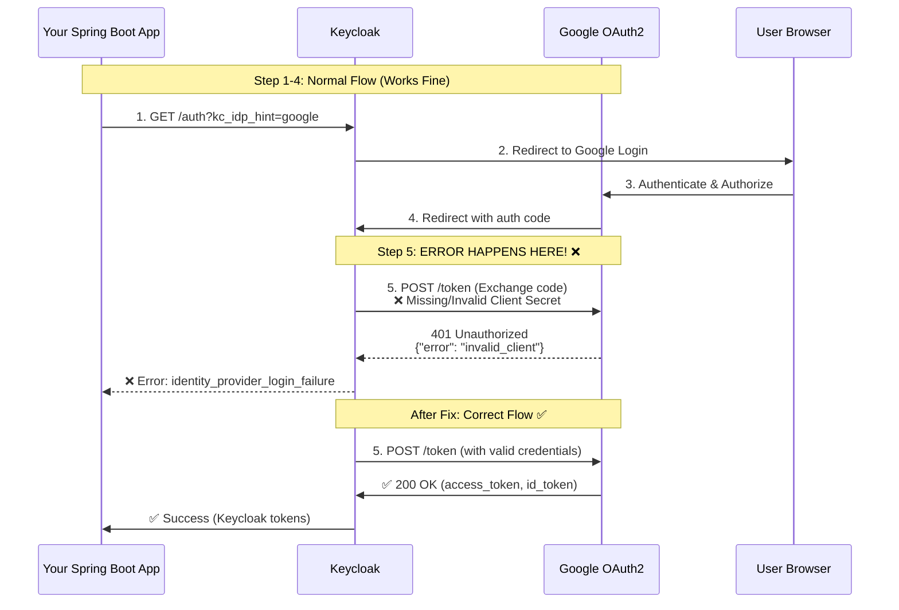
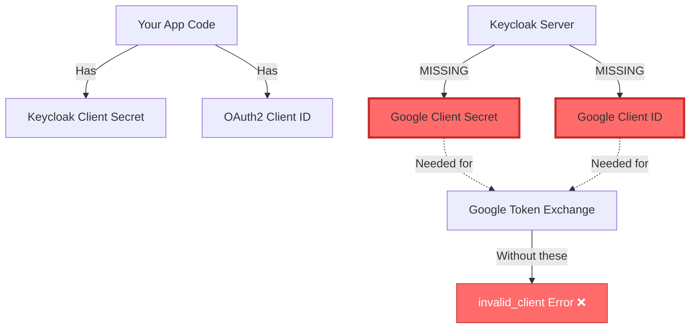
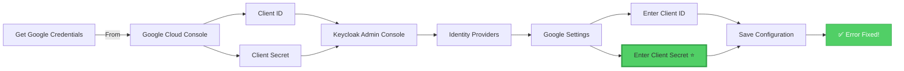
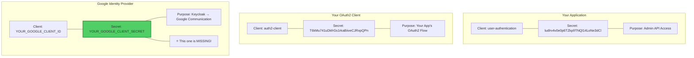
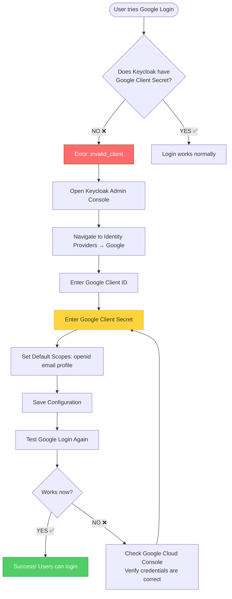

# Google OAuth2 Error Flow Diagram

## Where the "invalid_client" Error Occurs



## Problem: Missing Google Client Secret in Keycloak



## Solution: Configure in Keycloak Admin Console



## Configuration Locations

### ❌ WRONG: Putting Google Credentials Here

```
Your Spring Boot App
├── application.yml
│   ├── keycloak.admin.client-secret  (for admin API)
│   └── keycloak.auth2-client.client-secret  (for OAuth2)
│   ❌ DON'T PUT GOOGLE SECRETS HERE!
```

### ✅ CORRECT: Put Google Credentials Here

```
Keycloak Admin Console
└── user-authentication-realm
    └── Identity Providers
        └── Google
            ├── Client ID: YOUR_GOOGLE_CLIENT_ID ✅
            ├── Client Secret: YOUR_GOOGLE_CLIENT_SECRET ✅
            └── Default Scopes: openid email profile
```

## Three Different Client Secrets



## Step-by-Step Fix



## Quick Reference

| Location | What to Configure | Why |
|----------|-------------------|-----|
| **Google Cloud Console** | Create OAuth2 Client, Get Client ID & Secret | Generate credentials for Keycloak |
| **Keycloak Admin Console** | Enter Google Client ID & Secret in Identity Provider | ⭐ **THIS FIXES THE ERROR** |
| **application.yml** | Keycloak admin & OAuth2 client secrets | For your app to communicate with Keycloak |

## Key Takeaway

```
The error "invalid_client" from Google means:
→ Keycloak is trying to talk to Google
→ But Keycloak doesn't have valid Google credentials
→ Solution: Give Keycloak the Google Client Secret
→ Where: Keycloak Admin Console → Identity Providers → Google
```

